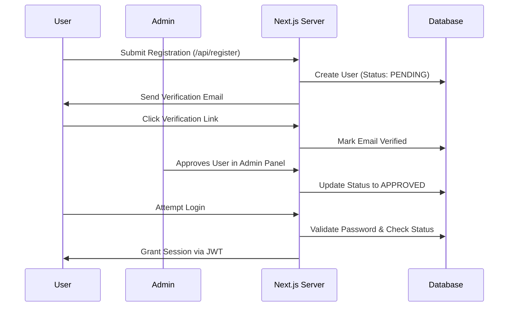

# Technical Design Document (TDD)

## 1. High-Level Architecture
This project is an internal lead generation and CRM application built with **Next.js (App Router)**, **React**, **Tailwind CSS**, and **Prisma ORM** connecting to a **Supabase PostgreSQL** database.

```mermaid
graph TD
    Client[Client Browser] -->|HTTP Requests| NextJS[Next.js Server]
    NextJS -->|Prisma Client| DB[(Supabase PostgreSQL)]
    NextJS -->|Fetch| GoogleMaps[Google Maps API]
    NextJS -->|SMTP| Nodemailer[Email Server (Hostinger)]
```

## 2. Database Connectivity
- **ORM Configuration:** Uses **Prisma**. The schema is located at `prisma/schema.prisma`.
- **Connections:** Supabase is utilized as the Postgres provider. The app uses pooled connection strings (`POSTGRES_PRISMA_URL`) to allow seamless serverless execution without exhausting concurrent DB connections.

## 3. Authentication & Registration Flow
- **Framework:** `NextAuth.js` utilizing the Credentials provider.
- **Roles & Statuses:** The `User` model defines enums for `role` (USER, ADMIN) and `status` (PENDING, APPROVED, REJECTED).
- **Process Diagram:**



## 4. Core Pages & UI Components

### `src/app/page.jsx` (Lead Discovery)
- **Functionality:** Central search page. Integrates with `@vis.gl/react-google-maps` to display map markers.
- **Logic:** Queries Google Places, and intercepts results with a local exclusion list (`hiddenPlaceIds`) fetched from the backend. This gracefully hides leads the user has already Saved or Skipped without impacting pagination.

### `src/app/pipeline/page.jsx` (CRM Dashboard)
- **Functionality:** Interactive sales pipeline. Displays Active Deals ("Consider") and "Skip" leads.
- **Logic:** Instead of hammering the database on every keystroke, inputs like the Notes region use *local state synchronization* with a manual "Save Notes" button for performance.

### `src/app/admin/page.jsx` (Admin Dashboard)
- **Functionality:** Secure area to manage platform access. Only accessible when `session.user.role === 'ADMIN'`.
- **Logic:** Lists all users, providing 1-click controls to Approve or Reject accounts.

## 5. Key API Routes
- **Auth:** `/api/auth/[...nextauth]/route.js` – Validates passwords and enforces the `APPROVED` requirement.
- **Admin Management:** `/api/admin/users/route.js` – Fetches users and manages status/role updates safely.
- **Lead Capture:** `/api/leads/save` – Upserts lead data into the CRM. Maps qualification statuses automatically if marked as "Skip".
- **Filtering Helper:** `/api/pipeline/ids/route.js` – High-performance route that returns an array of string `place_id`s the user has interacted with, allowing frontend UI to filter duplicate leads rapidly.
